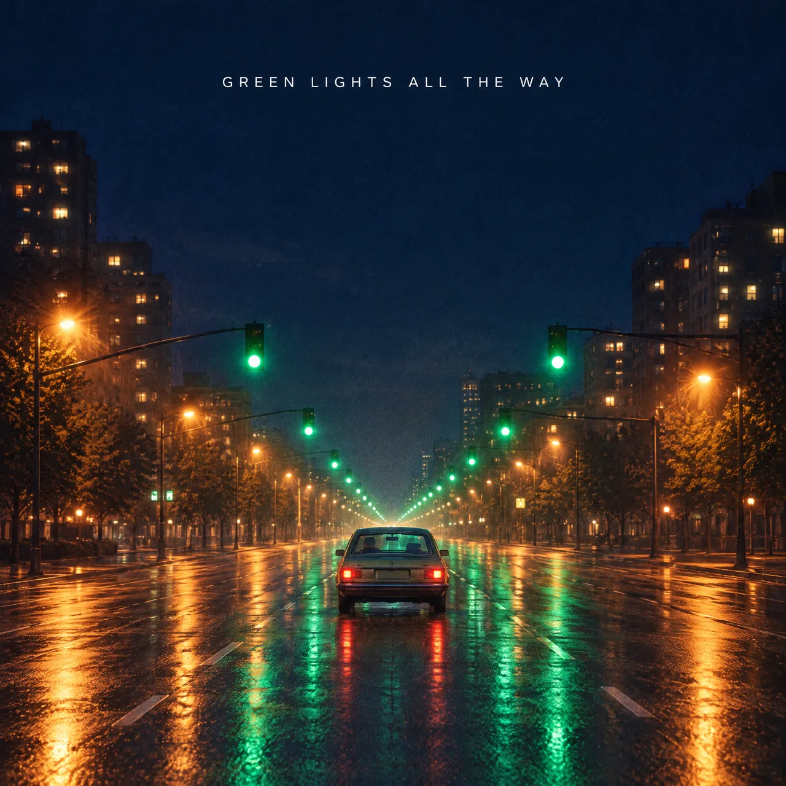

# AI Music Generator Skill

English | [简体中文](./README.zh-CN.md)

Turn a theme, lyrics, or reference audio into songs, instrumentals, and soundtracks, from inside Claude Code, Codex, or OpenClaw.

> [!IMPORTANT]
> Rendering needs a [Beatra](https://beatra.ai) account and uses credits. The skill itself is free to install.

| Question | Answer |
| --- | --- |
| **What it does** | Turn a theme, lyric, scene, or reference audio into reviewable songs, instrumentals, BGM, and soundtracks with a clear creative direction and focused revisions. |
| **Requirements** | Python 3.10+ and an agent that loads `SKILL.md` |
| **Cost** | Free to install. Each render uses credits on your Beatra account, and paid steps run only when you ask for that exact render or approve its card. |
| **Works with** | Claude Code, Codex, OpenClaw |

<p align="center"></p>

*Cover art for "Green Lights All the Way", a song about a late-night drive through an empty city. AI-generated with Beatra.*

| Skill | Entry point | Version |
| --- | --- | --- |
| [`music-generation-studio`](skills/music-generation-studio) | [SKILL.md](skills/music-generation-studio/SKILL.md) | 0.1.7 |

This repository is published automatically from [beatra-ai/beatra-skills](https://github.com/beatra-ai/beatra-skills/tree/main/skills/music-generation-studio). Report issues there.

## Install

With the [`skills`](https://skills.sh) CLI:

```bash
npx skills add beatra-ai/ai-music-generator-skill
```

With the GitHub CLI:

```bash
gh skill install beatra-ai/ai-music-generator-skill music-generation-studio
```

Or clone this repository and copy `skills/music-generation-studio` into `~/.claude/skills/` for Claude Code,
`~/.agents/skills/` for Codex, or `~/.openclaw/skills/` for OpenClaw.

Or paste this into your agent:

```text
Install the music-generation-studio skill from https://github.com/beatra-ai/ai-music-generator-skill (folder skills/music-generation-studio), then follow its SKILL.md to connect my Beatra account.
```

## Examples

<p align="center"></p>

[▶ Listen (MP3)](assets/sample.mp3)

*First 60 seconds of "Green Lights All the Way", an indie-pop song with a female lead, written and produced from a late-night city drive theme. AI-generated with Beatra.*

Prompt:

```text
Upbeat English indie-pop single about a late-night drive through an empty city. Arc: restless and quiet at the start, lifting into carefree release by the final chorus. Driving straight eighth-note groove, mid-fast tempo feel. Chorus-pedal electric guitar arpeggios, pulsing analog synth bass, bright vintage polysynth pads, crisp live drums with tambourine on the chorus. Compact conversational verses, rising pre-chorus, wide vowel-led chorus hook, short instrumental synth-guitar break, final chorus gains stacked harmonies, clean ending. Warm, slightly breathy female lead, natural English. Polished modern indie mix, wide stereo, warm tape sheen.
```

## What you get

- **Develop the whole musical idea** — Turn a fragment into a coherent title, hook, lyric, structure, vocal direction, and arrangement.
- **Choose the route that fits the destination** — Make a vocal song, instrumental, BGM, jingle, soundtrack, multilingual track, or reference-led arrangement from an existing recording.
- **Refine the strongest result** — Hear every returned version, preserve what works, and turn the biggest gap into one focused next direction.

## Use cases

- **Original songs from an idea** — Develop a story, mood, lyric fragment, or hook into a structured vocal track with a clear musical identity.
- **Lyrics into a song** — Use complete lyrics you provide or develop singable words before choosing the genre, voice, and arrangement.
- **Video, campaign, and brand music** — Create BGM, soundtracks, jingles, and campaign music around pace, emotion, dialogue space, and ending needs.
- **Games, podcasts, and product experiences** — Build themes, intros, transitions, atmosphere, and instrumental cues from a functional brief.
- **Multilingual and reference-led directions** — Plan bilingual songs or new arrangements from reference audio, then review melody, vocal character, and arrangement against the intended direction.

## FAQ

### What can Music Generation Studio make?

It can develop and create original songs, instrumentals, BGM, video and game soundtracks, jingles, brand music, podcast themes, multilingual tracks, and reference-led new arrangements.

### Can it write lyrics or use lyrics I already have?

Yes. It can develop singable lyrics from a brief or use complete lyrics you provide, keeping the words aligned with the selected genre, mood, structure, vocal, and arrangement direction.

### How can I shape instrumentals, loopable BGM, and track length?

Set the target duration, ending, loop point, energy curve, dialogue space, and instrumental palette, then listen to the result and refine the timing or edit point for its destination.

### Does it only use Suno?

Suno 5.5 is the creative default. You can explicitly choose another currently available music model when its capabilities fit the brief.

### Can it use reference audio for a new arrangement?

Yes. Choose what should carry over and what should change, then review the returned melody, vocal character, energy, instrumentation, and arrangement against that direction.

## Updates

Each installed skill checks for a new version at most once a day, verifies the
official archive before replacing itself, and leaves your installation untouched
if anything fails. Turn it off at any time — see
`references/automatic-updates-and-safety.md` inside the skill.

## License

[MIT-0](LICENSE) — free to use, modify, and redistribute, including
commercially. No attribution required. Same terms as these skills carry on
ClawHub.
